# Pixel Backup

Eine Anwendung für **Windows und Linux** (C# / .NET 10 / Avalonia) zum vollständigen Sichern und Wiederherstellen
von **Android-Geräten** – ähnlich wie Samsung Smart Switch, aber herstellerunabhängig und ohne
zusätzliche App auf dem Telefon.

Die gesamte Gerätekommunikation läuft nativ über **adb** (Android Debug Bridge). Damit funktioniert
das Programm mit jedem Android-Gerät, das USB-Debugging beherrscht – Google Pixel, Samsung, Xiaomi,
OnePlus, Motorola, Sony, Fairphone und andere.

**Windows ist das Hauptsystem**, für das die Anwendung gedacht ist. **Linux wird gleichwertig
unterstützt** – mit Startmenü-Eintrag, Installationsskript und den Geräteregeln (udev) direkt aus
der Anwendung heraus.

> Die Sicherungen sind **keine undurchsichtigen Container**: Fotos bleiben Fotos, Dokumente bleiben
> Dokumente. Jeder Sicherungssatz lässt sich im Explorer öffnen und einzeln weiterverwenden.

> **Kurz zu Android 13+ (auch 16/17):** Dateien, Apps, Kontakte, SMS, Anrufliste und Kalender lassen
> sich vollständig sichern und auf ein neues Telefon bringen. Die **Daten installierter Apps** kann
> ohne Root kein PC-Werkzeug mehr auslesen – das verbietet Android seit Version 12.
> Details und den empfohlenen Umzugsweg beschreibt der Abschnitt
> [„Was auf Android 13–17 wirklich geht“](#was-auf-android-13-14-15-16-und-17-wirklich-geht).

---

## Oberfläche

### Echte Aufnahmen des laufenden Programms

Gebaut mit dem .NET-10-SDK, gestartet unter X11 und unter Wayland (Ubuntu 24.04); im Testlauf war **kein Gerät
angeschlossen** und es lagen **keine Sicherungen** vor – deshalb sind die Listen leer. Unter Windows
sieht die Anwendung genauso aus, nur mit den Windows-eigenen Bedienelementen.

**Gerät** – ohne angeschlossenes Telefon; unten rechts meldet die Statuszeile den fehlenden adb-Stand

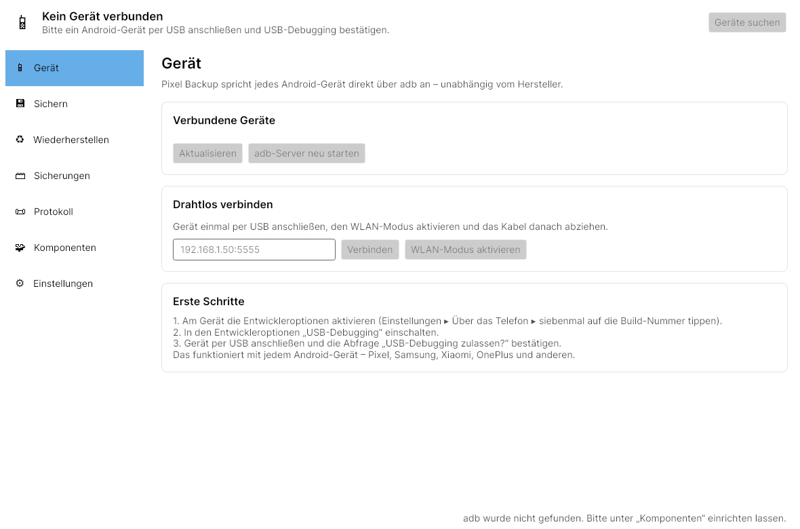

**Sichern** – die Gruppenliste mit Beschreibungen und Hinweisen

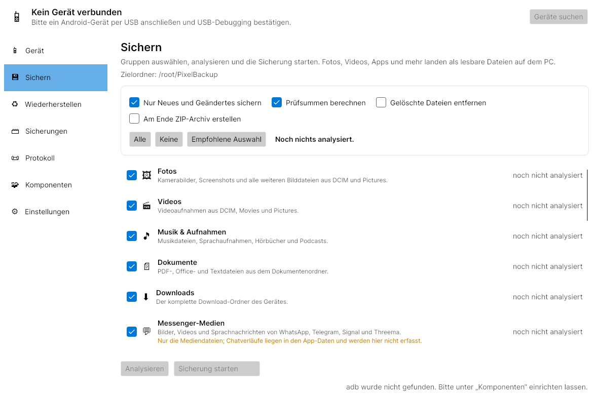

**Wiederherstellen** – Satzliste, Konfliktstrategie und Optionen

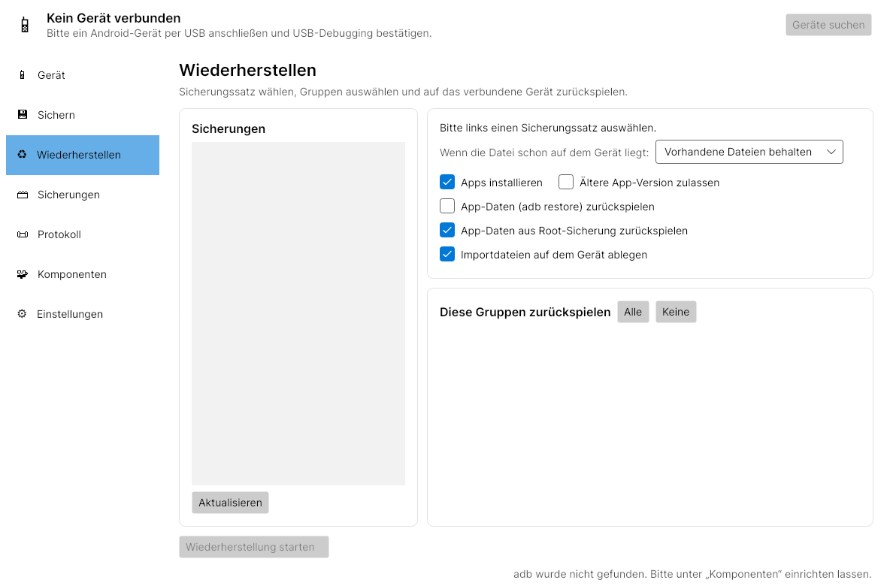

**Einstellungen** – Sprache und Erscheinungsbild mit dem, was am System erkannt wurde

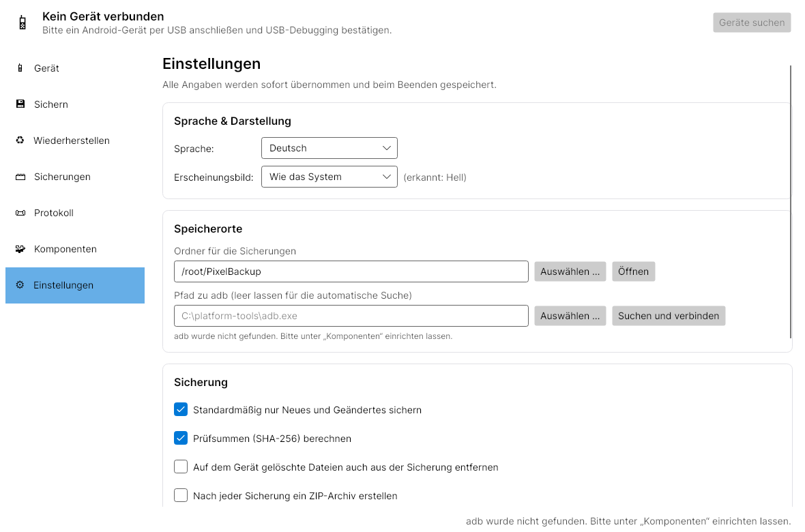

**Komponenten, dunkles Erscheinungsbild** – adb fehlt und kann installiert werden; unter Linux
wird kein USB-Treiber benötigt

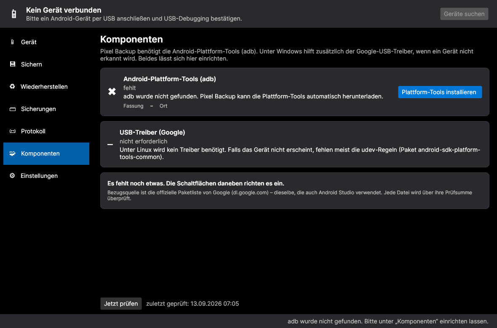

**English** – dasselbe Programm auf einem System mit englischer Anzeigesprache (keine Einstellung
nötig, die Sprache wird erkannt)

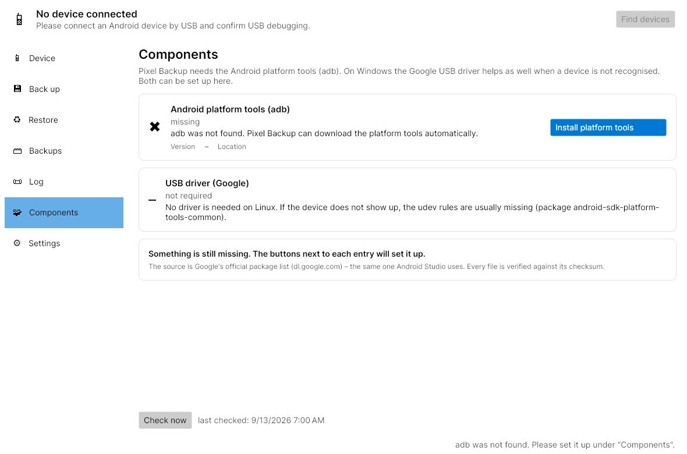

**Unter Wayland** – dieselbe Anwendung in einer echten Wayland-Sitzung (Weston), gezeichnet über
XWayland

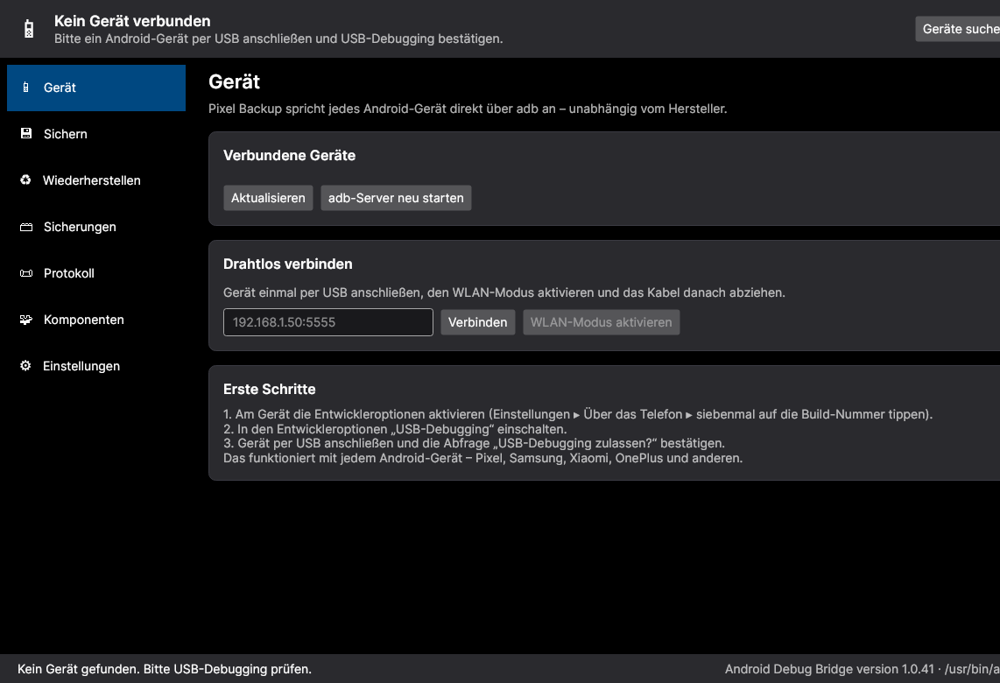

**Komponenten unter X11** – die Zeile „System“ nennt Verteilung und Art der Sitzung; hier sind adb
und die Geräteregeln eingerichtet

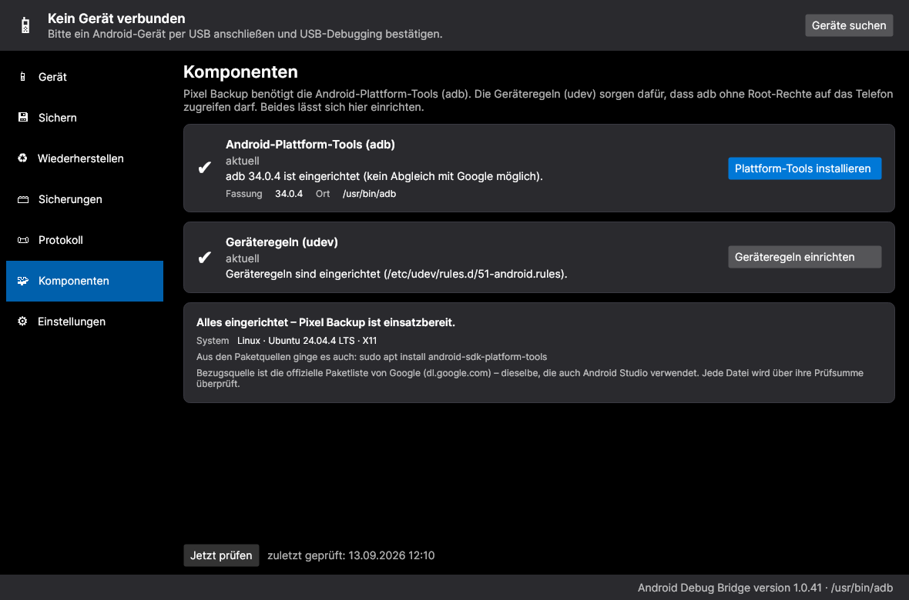

**Sichern** – die kompakte Oberfläche (1180 × 720): Sprache und Hell/Dunkel oben rechts,
der Speicherort direkt über den Gruppen

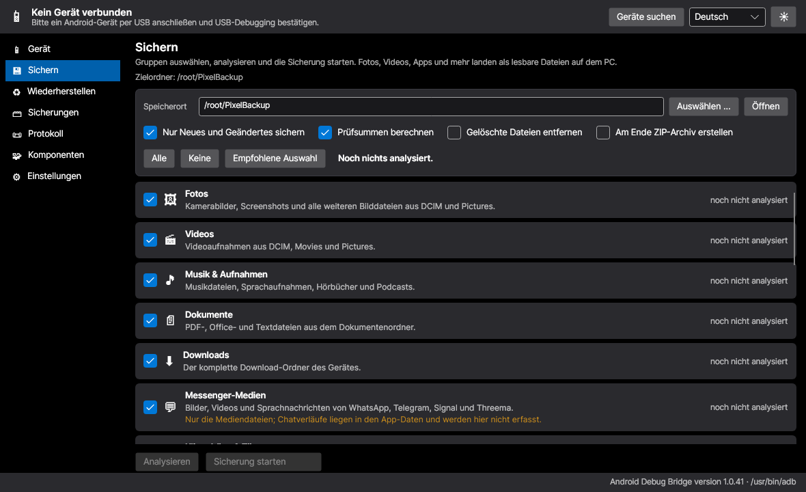

**English, hell** – dieselbe Anwendung nach zwei Klicks in der Kopfzeile

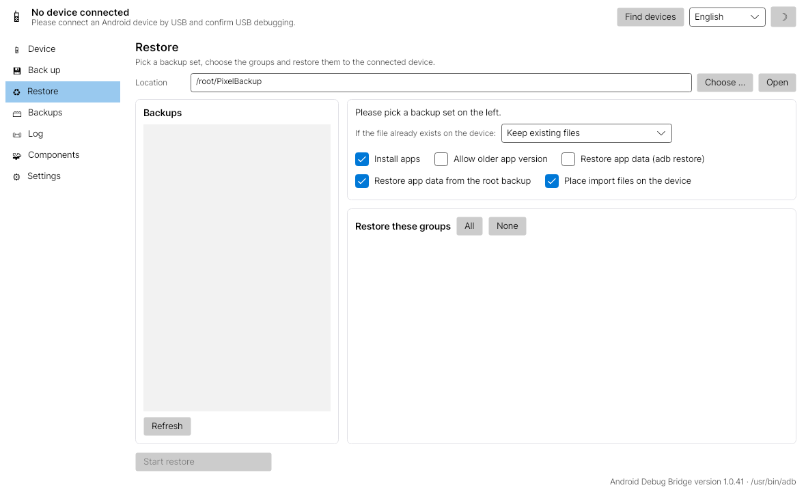

**Versionscheck** – dieselbe Seite mit einer angebotenen Aktualisierung: Pixel Backup erkennt die
eigene Fassung und die Einbauart und spielt auf Knopfdruck die passende Datei ein

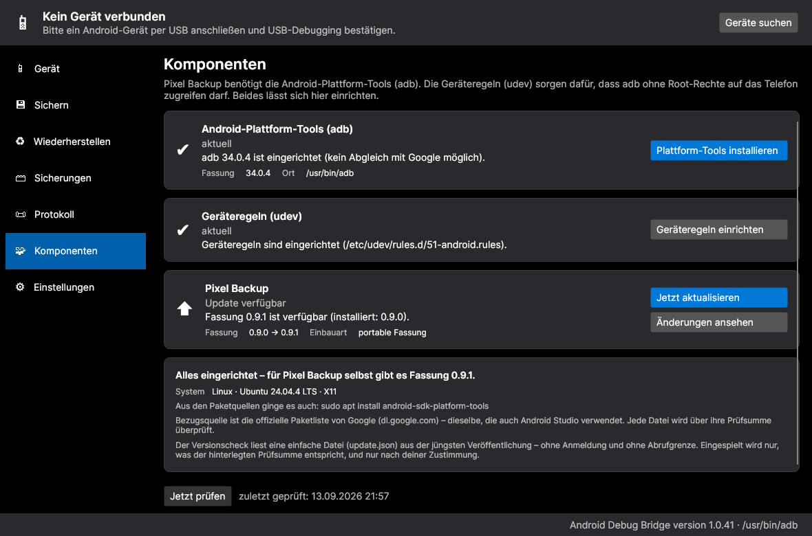

### Mit angeschlossenem Gerät

Diese Bilder sind **maßstabsgetreue Layout-Darstellungen** aus dem XAML (kein Testlauf), weil hier
kein Android-Gerät und keine Sicherungen zur Verfügung standen:

**Sichern mit laufender Sicherung** – Fortschritt, Geschwindigkeit und Restzeit

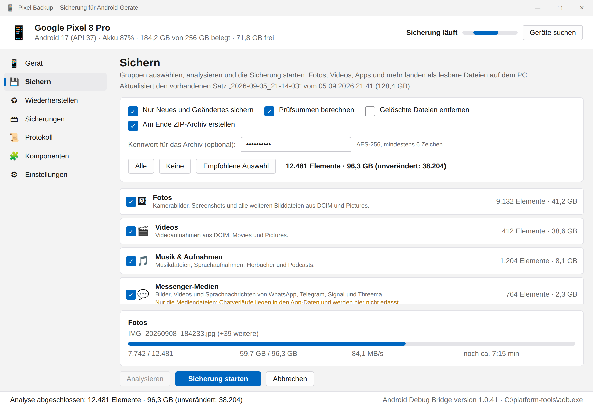

**Gruppen** – auf Android 13+ werden nicht mögliche Gruppen gesperrt und begründet

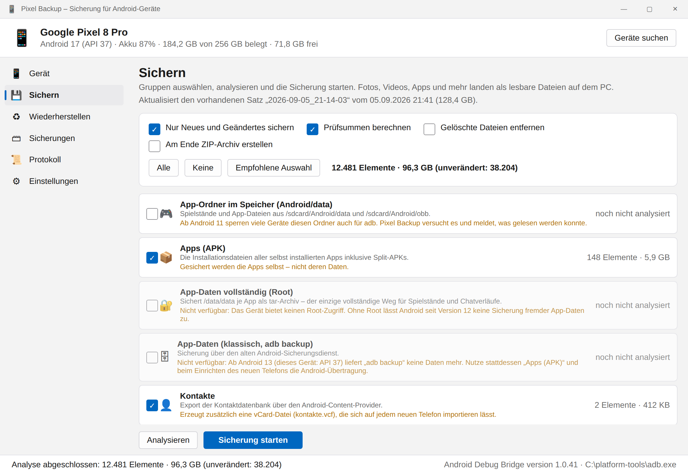

**Wiederherstellen** (dunkel) – mit Sicherungssätzen und Gruppen

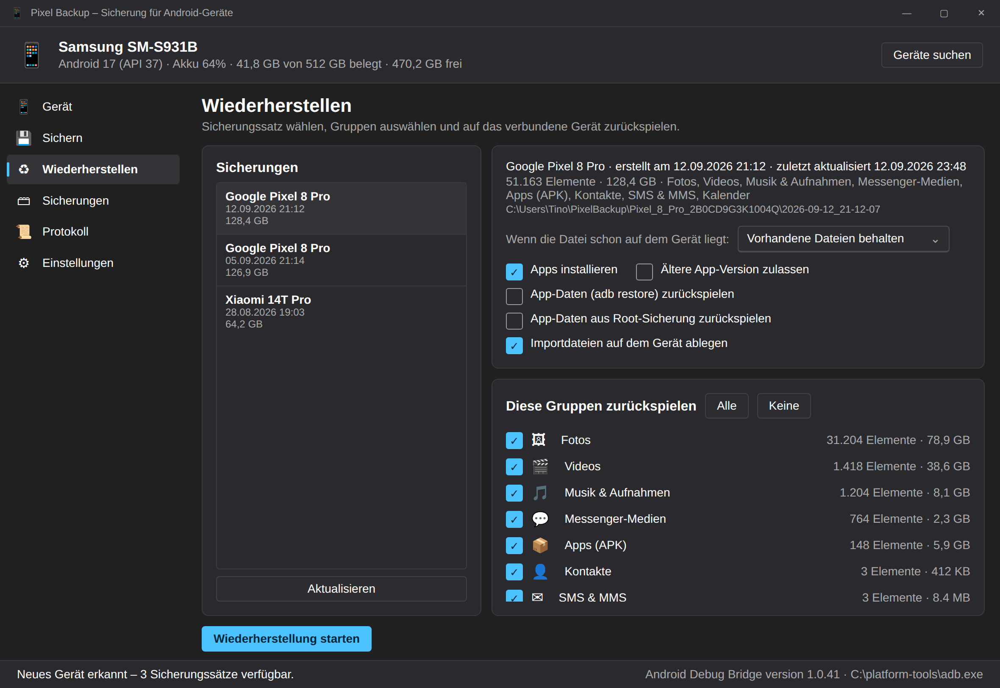

**Sicherungen** – Inhalt und Laufhistorie eines Satzes

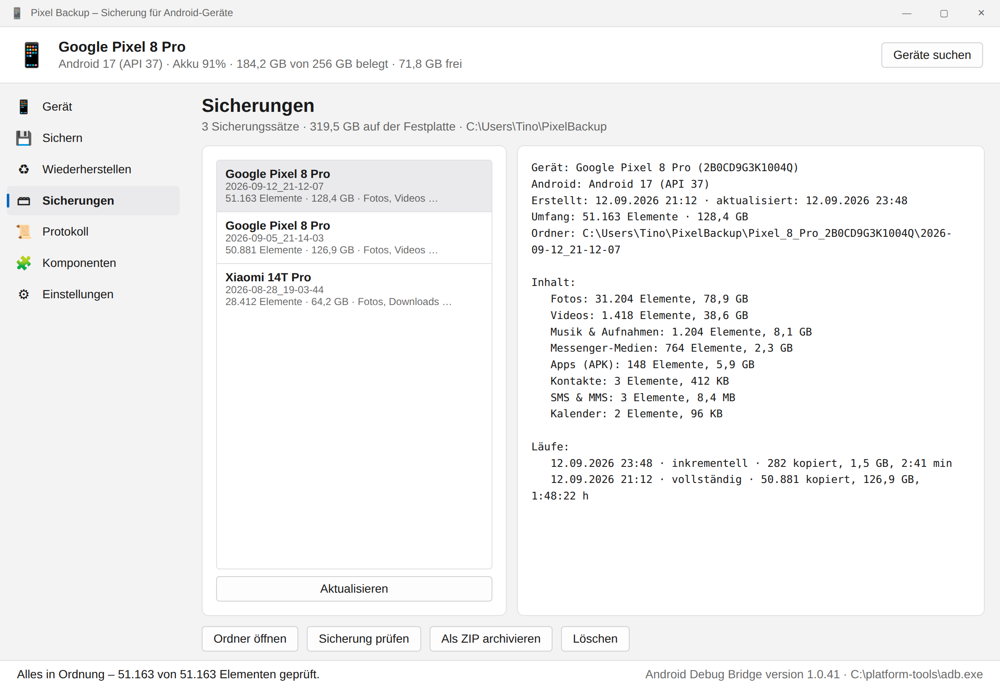

---

## Funktionsumfang

### Vollsicherung
* Sichert den internen Speicher, die installierten Apps und Datenexporte in einem Durchgang.
* Sicherungssätze werden pro Gerät und Zeitpunkt abgelegt, inklusive Manifest (`manifest.json`)
  und lesbarem Bericht (`bericht.txt`).

### Gruppenweise sichern
Statt „alles oder nichts“ lässt sich jede Gruppe einzeln an- und abwählen:

| Gruppe | Inhalt |
| --- | --- |
| 🖼 Fotos | `DCIM`, `Pictures`, `Camera`, `Screenshots` – jpg, png, heic, webp, dng, … |
| 🎬 Videos | `DCIM`, `Movies`, `Pictures` – mp4, mkv, mov, … |
| 🎵 Musik & Aufnahmen | `Music`, `Recordings`, `Podcasts`, `Audiobooks` sowie herstellereigene Aufnahmeordner (Samsung `Sounds`, Xiaomi `MIUI/sound_recorder`, Sony, LG) |
| 📄 Dokumente | `Documents`, `Books` |
| ⬇ Downloads | kompletter Download-Ordner |
| 💬 Messenger-Medien | WhatsApp (auch Business), Telegram, Signal, Threema (Mediendateien) |
| 🔔 Klingeltöne & Töne | `Ringtones`, `Notifications`, `Alarms` |
| 📶 Bluetooth-Empfang | `Bluetooth`, `NearbyShare` |
| 🗂 Sonstige Dateien | alles Übrige im internen Speicher (ohne `Android/`) |
| 🎮 App-Ordner im Speicher | `Android/data`, `Android/obb` – Spielstände, soweit das Gerät den Zugriff erlaubt |
| 📦 Apps (APK) | alle selbst installierten Apps inkl. Split-APKs |
| 🔐 App-Daten vollständig | `/data/data` je App als tar-Archiv – **nur mit Root** |
| 🗄 App-Daten (klassisch) | `adb backup` – nur für Geräte bis Android 11 sinnvoll |
| 👤 Kontakte | Export über den Content-Provider (Rohdaten + CSV) |
| ✉ SMS & MMS | Export über den Content-Provider (Rohdaten + CSV) |
| 📞 Anrufliste | Export über den Content-Provider (Rohdaten + CSV) |
| 📅 Kalender | Termine aus dem Gerätekalender (Rohdaten + CSV) |
| ⚙ Systemeinstellungen | `settings list system/secure/global` als Dokumentation |

Die Ordnerlisten decken bewusst auch herstellereigene Pfade ab; alles, was dort nicht erfasst
ist, fängt die Gruppe „Sonstige Dateien“ auf. So bleibt die Sicherung auf jedem Android-Gerät
vollständig, ohne Sonderbehandlung je Marke.

Überschneidungen werden automatisch aufgelöst: Ein Video im Ordner `DCIM` landet genau einmal in
der Sicherung, auch wenn „Fotos“ und „Videos“ gleichzeitig gewählt sind.

### Wiederherstellen
* Auswahl von Sicherungssatz **und** Gruppen.
* Konfliktstrategie je Lauf: vorhandene Dateien behalten, überschreiben oder beide behalten.
* Apps werden per `adb install` bzw. `install-multiple` (Split-APKs) installiert.
* Nach dem Kopieren wird der Medienscanner angestoßen, damit Fotos sofort in der Galerie erscheinen.

### Umzug auf ein neues Telefon

Aus den Datenexporten erzeugt Pixel Backup automatisch Dateien, die sich auf **jedem** neuen
Android-Telefon einspielen lassen:

| Datei | Inhalt | Import auf dem neuen Telefon |
| --- | --- | --- |
| `data/kontakte.vcf` | Namen, Rufnummern, E-Mail-Adressen | Kontakte-App ▸ Importieren |
| `data/kalender.ics` | Termine | Kalender-App bzw. calendar.google.com ▸ Importieren |
| `data/sms.xml` | SMS/MMS | App „SMS Backup & Restore“ ▸ Wiederherstellen |
| `data/anrufliste.xml` | Anrufliste | App „SMS Backup & Restore“ ▸ Wiederherstellen |

Beim Wiederherstellen legt Pixel Backup diese Dateien unter `/sdcard/PixelBackup-Import` auf dem
Zielgerät ab. Jeder Sicherungssatz enthält zusätzlich `umzug-anleitung.txt` mit den Schritten für
genau diesen Satz.

### Kommandozeile

* Jeder Handgriff geht auch ohne Fenster: `devices`, `info`, `categories`, `backup`, `restore`,
  `list`, `verify`, `components`, `update`.
* Für Skripte: `--json`, `--quiet`, `--dry-run` und feste Rückgabewerte.
* **Handbuchseite**: unter Linux `man pixel-backup`, unter Windows `PixelBackup.exe manual`.
* Einzelheiten im Abschnitt [„Kommandozeile“](#kommandozeile-cli).

### Versionscheck und Aktualisierung

* Erkennt die eigene Fassung **und die Einbauart** (EXE, `.deb`, `.rpm`, AppImage, Flatpak,
  portabel) und bietet genau die dazu passende Datei an.
* Holt und prüft sie selbst: SHA-256 muss stimmen, sonst wird nichts eingespielt.
* Tauscht die Programmdatei aus und startet neu – oder übergibt das Paket der Paketverwaltung.
* Läuft beim Start (abschaltbar) und jederzeit über die Seite „Komponenten“.
* Einzelheiten im Abschnitt [„Versionscheck und Aktualisierung“](#versionscheck-und-aktualisierung).

### Sprache, Erscheinungsbild und Komponenten

* **Oben rechts umschaltbar** – Sprache (Deutsch/English) und Hell/Dunkel liegen in der
  Kopfzeile, nicht versteckt in den Einstellungen; beides wirkt sofort und wird gemerkt.
* **Deutsch und Englisch** – die Oberfläche startet in der **Anzeigesprache des Systems**
  (Deutsch bei einem deutschen System, sonst Englisch) und lässt sich jederzeit umschalten;
  die Umschaltung wirkt sofort, ohne Neustart.
* **Hell und dunkel** – Voreinstellung ist „Wie das System“: Pixel Backup übernimmt den
  Hell-/Dunkelmodus des Betriebssystems und zeigt an, was erkannt wurde. Feste Wahl ist möglich.
* **Komponenten-Seite** – prüft die Android-Plattform-Tools (adb) und unter Windows den
  Google-USB-Treiber:
  * fehlt adb, wird es **beim Start automatisch** aus Googles offizieller Paketliste geladen
    (SHA-1-geprüft) und eingerichtet;
  * gibt es eine neuere Fassung, erscheint ein **Update-Angebot** (kein stiller Austausch);
  * meldet Windows ein Problemgerät oder fehlt der USB-Treiber, lässt er sich von hier aus
    laden und über `pnputil` installieren.

### Weitere Funktionen
* **Analyse vorab** – zeigt je Gruppe Anzahl und Größe an, bevor etwas übertragen wird.
* **Inkrementelle Sicherung** – überträgt nur neue und geänderte Dateien (Vergleich über Größe und
  Zeitstempel); auf Wunsch werden am Gerät gelöschte Dateien auch aus der Sicherung entfernt.
* **Stapelübertragung** – bis zu 40 Dateien pro adb-Aufruf, was bei vielen kleinen Dateien um ein
  Vielfaches schneller ist als Einzelaufrufe.
* **Prüfsummen & Überprüfung** – SHA-256 je Datei; eine Sicherung lässt sich jederzeit gegen das
  Manifest prüfen (fehlend / falsche Größe / falsche Prüfsumme).
* **ZIP-Archiv mit optionaler Verschlüsselung** – AES-256-GCM, Schlüssel über PBKDF2 (210 000
  Iterationen) aus dem Kennwort.
* **Aufbewahrungsregel** – ältere Sicherungssätze je Gerät automatisch aufräumen.
* **Automatische Sicherung**, sobald ein Gerät angeschlossen wird (optional).
* **WLAN-Modus** – `adb tcpip` aktivieren und drahtlos weiterarbeiten.
* **Fortschritt mit Geschwindigkeit und Restzeit**, jederzeit abbrechbar; abgebrochene Läufe
  hinterlassen einen gültigen, weiterverwendbaren Sicherungssatz.
* **Protokoll** in der Oberfläche und als Tagesdatei unter `%APPDATA%\PixelBackup\logs`.
* Helles und dunkles Erscheinungsbild.

---

## Betriebssysteme

| System | Stand |
| --- | --- |
| **Windows 10 / 11** (x64, ARM64) | **Hauptsystem.** USB-Treiberprüfung und -einrichtung über `pnputil`, eigenständige EXE über das Veröffentlichungsskript. |
| **Linux** – Debian, Ubuntu, Mint, Arch, Manjaro, Fedora, openSUSE, Alpine … | **Voll unterstützt.** Gleicher Funktionsumfang, Startmenü-Eintrag, Erkennung der Verteilung, Geräteregeln (udev) aus der Anwendung heraus. |
| macOS (x64, Apple Silicon) | Läuft grundsätzlich (Avalonia und adb sind dort zu Hause), wird aber nicht regelmäßig geprüft. Ein Treiber wird nicht benötigt. |

Der Unterschied zwischen den Systemen betrifft nur den Zugang zum Gerät:

* **Windows** braucht bei manchen Geräten den **Google-USB-Treiber**.
* **Linux** braucht **udev-Regeln**, sonst meldet adb `no permissions`. Pixel Backup erkennt das,
  schreibt die Regeln auf Wunsch nach `/etc/udev/rules.d/51-android.rules`, legt die Gruppe
  `plugdev` an und lädt die Regeln neu.
* **macOS** braucht nichts davon.

### X11 und Wayland

Die Oberfläche läuft unter **beiden** Sitzungsarten. Avalonia zeichnet über **X11**; in einer
**Wayland-Sitzung** (GNOME, KDE Plasma, Sway, Weston …) übernimmt das **XWayland** – auf allen
gängigen Verteilungen ist es Teil der Standardinstallation. Es ist nichts einzustellen.

* Die Anwendung **erkennt die Sitzungsart** (`XDG_SESSION_TYPE`, `WAYLAND_DISPLAY`, `DISPLAY`) und
  nennt sie auf der Seite **Komponenten** sowie in der ersten Zeile des Protokolls, zum Beispiel
  `System: Ubuntu 24.04.4 LTS · Wayland (über XWayland)` oder `… · X11`.
* Fehlt eine Anzeige, bricht sie nicht mit einem Stapelauszug ab, sondern erklärt den Grund und
  nennt den passenden Befehl:

  ```
  $ pixel-backup
  Pixel Backup: Diese Sitzung läuft unter Wayland, aber XWayland ist nicht erreichbar
  (DISPLAY ist leer). Nachrüsten mit: sudo apt install xwayland
  $ echo $?
  78
  ```

  Ohne jede grafische Sitzung (etwa über SSH) weist sie auf `ssh -X` hin.
* Dateiauswahl und Menüs laufen über die **Portale des Desktops** (`UseDBusFilePicker`,
  `UseDBusMenu`), damit sie sich unter Wayland-Desktops so verhalten wie dort üblich.
* Der Startmenü-Eintrag setzt `StartupWMClass=PixelBackup` passend zur `WM_CLASS` des Fensters –
  so ordnen GNOME und KDE das Fenster dem Symbol in der Leiste zu.
* Das Flatpak-Bündel gibt beide Sockets frei (`--socket=x11`, `--socket=wayland`).

Geprüft wurde das auf Ubuntu 24.04 in einer echten Wayland-Sitzung (Weston 13 mit Xwayland 23.2.6)
und unter X11 – in beiden Fällen mit denselben Aufnahmen oben.

## Voraussetzungen

* **Windows 10/11** (Hauptsystem) oder **Linux**; macOS läuft ebenfalls.
* [.NET 10 SDK](https://dotnet.microsoft.com/download) zum Bauen bzw. die .NET 10 Desktop Runtime
  zum Ausführen (dieselbe Grundlage wie OfficeInstall). Wer die eigenständigen Fassungen aus
  `packaging/` verwendet, braucht auf dem Zielrechner gar kein .NET.
* **Android-Plattform-Tools (`adb`) – müssen nicht von Hand installiert werden.**
  Pixel Backup sucht `adb` in PATH, im Android-SDK, neben der Anwendung und an den üblichen
  Orten; findet es nichts, lädt es die Plattform-Tools beim Start selbst herunter:
  * Windows: `%LOCALAPPDATA%\PixelBackup\platform-tools`
  * Linux/macOS: `~/.local/share/PixelBackup/platform-tools`

  Unter Linux geht genauso gut das Paket der Verteilung (`android-sdk-platform-tools`,
  `android-tools`); der Pfad lässt sich in den Einstellungen jederzeit überschreiben.
* **Gerätezugang** – unter Windows bei Bedarf der Google-USB-Treiber, unter Linux die udev-Regeln.
  Die Komponenten-Seite erkennt beides und richtet es ein.
* **Systembibliotheken unter Linux** – auf einem gewöhnlichen Desktop ist alles längst da; die
  Pakete (`.deb`, `.rpm`, PKGBUILD) fordern sie ohnehin an. Gebraucht werden `libX11`, `libXext`,
  `libXi`, `libXrandr`, `libXcursor`, `libXfixes`, `libICE`, `libSM`, `fontconfig`, `freetype`,
  `icu` und `zlib`; `libGL` ist freiwillig (ohne zeichnet die Anwendung in Software). Fehlt eine,
  nennt die Anwendung beim Start Namen **und** Installationsbefehl der erkannten Verteilung:

  ```
  $ pixel-backup
  Pixel Backup: Es fehlt die Systembibliothek libX11.so.6. Nachrüsten mit: sudo apt install libx11-6
  Grafische Sitzung: X11
  ```
* Am Gerät: **Entwickleroptionen** aktivieren (siebenmal auf die Build-Nummer tippen) und
  **USB-Debugging** einschalten. Beim ersten Anschließen die Abfrage am Telefon bestätigen.

---

## Bauen und starten

```bash
dotnet restore
dotnet build -c Release
dotnet run --project src/PixelBackup.App
```

Die Oberfläche baut auf Avalonia 11.3.22 auf. Der Stand ist mit dem .NET-10-SDK gebaut, gestartet
und getestet: `dotnet build -c Release` läuft ohne Warnung durch, `dotnet test` meldet 200 grüne
Tests, und die Anwendung startet unter X11 **und** unter Wayland (siehe Aufnahmen oben).

Eigenständige Windows-Datei erzeugen:

```bash
dotnet publish src/PixelBackup.App -c Release -r win-x64 --self-contained true ^
  -p:PublishSingleFile=true -o publish
```

Tests:

```bash
dotnet test
```

---

## Bereitstellung: was beim Bauen herauskommt

| | **Windows** | **Linux** |
| --- | --- | --- |
| Ergebnis | `PixelBackup.exe` | `PixelBackup` – eine ausführbare ELF-Datei **ohne Endung** |
| Größe (eigenständig) | 46 MiB, eine Datei | 46 MiB, eine Datei |
| .NET auf dem Zielrechner | nicht nötig | nicht nötig |
| Erzeugt mit | `packaging\windows\publish.ps1` | `packaging/linux/install.sh` bzw. `package.sh` |
| Verteilbare Pakete | die EXE selbst | `.deb`, `.rpm`, `.AppImage`, Flatpak-Bündel und `.tar.gz`, dazu ein PKGBUILD für Arch |

**Warum nur 46 MiB:** Die eingebettete .NET-Laufzeit wird in der Einzeldatei komprimiert
(`EnableCompressionInSingleFile`). Das halbiert die Datei – aus 91 MiB werden 46 MiB, aus der
Windows-EXE 96 MiB → 46 MiB. Beim ersten Start entpackt die Laufzeit sie einmalig in den
Zwischenspeicher des Benutzers; das kostet gemessen rund eine Zehntelsekunde (0,97 s statt 0,84 s
bis zum Fenster), jeder weitere Start ist gleich schnell.

Eine Ausnahme ist die **AppImage**: Sie ist selbst schon ein komprimiertes Dateisystem. Dort steckt
deshalb bewusst die unkomprimierte Fassung – zweimal komprimieren würde die Datei nur größer machen
(39 MB statt 34 MB). Bei `.deb` und `.rpm` ist es umgekehrt: das Paket wird etwas größer
(38 statt 32 MB), dafür belegt die eingespielte Anwendung 46 statt 91 MiB auf der Platte.

Unter Linux gibt es kein Gegenstück zur EXE-Datei mit Doppelklick-Kultur – üblich sind ein **Paket
der Verteilung**, ein **portables Archiv** oder ein in sich geschlossenes Format wie AppImage und
Flatpak. Ein Aufruf erzeugt alle fünf:

```bash
./packaging/linux/package.sh                 # alle Formate
./packaging/linux/package.sh --formats deb,rpm   # nur bestimmte
./packaging/linux/package.sh --require-all   # bricht ab, wenn eines fehlt (für die CI)
```

```
dist/pixel-backup_0.9.0_amd64.deb            Debian, Ubuntu, Mint, Pop!_OS …   38 MB
dist/pixel-backup-0.9.0-1.x86_64.rpm         Fedora, openSUSE, RHEL …          39 MB
dist/PixelBackup-0.9.0-x86_64.AppImage       läuft ohne Installation           34 MB
dist/pixel-backup-0.9.0.flatpak              Flatpak-Bündel
dist/pixel-backup-0.9.0-linux-x64.tar.gz     portabel, jede Verteilung         39 MB
```

Fehlt ein Werkzeug (`rpmbuild`, `mksquashfs`, `flatpak-builder`), wird **nur dieses Format
übersprungen** und am Ende benannt – der Rest entsteht trotzdem.

**Einspielen:**

```bash
sudo apt install ./dist/pixel-backup_0.9.0_amd64.deb      # Debian-Familie
sudo dnf install ./dist/pixel-backup-0.9.0-1.x86_64.rpm   # Fedora, RHEL
chmod +x dist/PixelBackup-0.9.0-x86_64.AppImage && ./dist/PixelBackup-0.9.0-x86_64.AppImage
flatpak install --user ./dist/pixel-backup-0.9.0.flatpak  # Flatpak
tar xzf pixel-backup-0.9.0-linux-x64.tar.gz               # portabel
./pixel-backup-0.9.0/install.sh                           # trägt es ins Startmenü ein
cd packaging/arch && makepkg -si                          # Arch, Manjaro
```

Das Paket legt ab:

```
/usr/lib/pixel-backup/PixelBackup           die Anwendung (eine Datei)
/usr/bin/pixel-backup                       Starter für die Kommandozeile
/usr/share/applications/pixel-backup.desktop  Eintrag im Startmenü
/usr/share/icons/hicolor/…/pixel-backup.png   Symbole
```

Danach steht „Pixel Backup“ im Startmenü und lässt sich im Terminal mit `pixel-backup` aufrufen.
Entfernen: `sudo apt remove pixel-backup` beziehungsweise `./packaging/linux/uninstall.sh`.

Wer lieber mit installiertem .NET arbeitet, spart Platz: eine framework-abhängige Fassung
(`dotnet publish -c Release -r linux-x64 --self-contained false`) belegt 22 MB statt 46 MiB,
setzt dann aber die .NET-10-Runtime auf dem Zielrechner voraus.

## Kommandozeile (CLI)

Ohne Argumente startet die Oberfläche, mit einem Befehl arbeitet dieselbe Datei auf der
Kommandozeile – unter Linux wie unter Windows. Unter Windows hängt sich das Programm dafür an
die Konsole des Aufrufers; ein Doppelklick startet weiterhin das Fenster.

```
pixel-backup                        startet die Oberfläche
pixel-backup <Befehl> [Optionen]
```

| Befehl | Was er tut |
| --- | --- |
| `devices` | verbundene Geräte auflisten |
| `info` | Android-Fassung, Akku, Speicher, Root |
| `categories` | Gruppen samt Kennung auflisten |
| `backup` | Sicherung anlegen |
| `restore` | Sicherung zurückspielen (verlangt `--yes`) |
| `list` | vorhandene Sicherungssätze auflisten |
| `verify` | Satz gegen die Prüfsummen prüfen |
| `components` | adb und Gerätezugang prüfen (`--install` richtet ein) |
| `update` | Versionscheck (`--install --yes` spielt ein) |
| `gui`, `help`, `version`, `manual` | Oberfläche, Hilfe, Fassung, Handbuch |

Die wichtigsten Optionen: `--device`, `--output`, `--categories`, `--all`, `--set`,
`--incremental`, `--no-hashes`, `--archive`, `--password`, `--conflict skip|overwrite|both`,
`--dry-run`, `--yes`, `--json`, `--quiet`, `--language de|en`.

```bash
pixel-backup devices
pixel-backup backup --categories photos,videos --output /mnt/platte
pixel-backup backup --all --incremental --quiet     # z. B. aus cron
pixel-backup list --json
pixel-backup restore --set 2026-09-15_Pixel-8 --conflict skip --yes
pixel-backup verify --set 2026-09-15_Pixel-8
```

**Rückgabewerte** – gedacht für Skripte: `0` in Ordnung, `1` Fehler, `2` falscher Aufruf,
`3` kein Gerät, `4` adb fehlt, `130` abgebrochen.

**Handbuch**: Die Handbuchseite liegt in allen Linux-Paketen (`man pixel-backup`). Unter Windows
gibt es dieselbe Fassung als Text – `PixelBackup.exe manual` gibt sie aus, und `HANDBUCH.txt`
liegt neben der EXE. Quelle ist `packaging/man/pixel-backup.1`; die Textfassung erzeugt
`packaging/man/render.sh`, und ein Test wacht darüber, dass beide alle Befehle und Optionen
nennen.

## Versionscheck und Aktualisierung

Pixel Backup weiß, **welche Fassung** es ist und **wie es eingespielt wurde** – und holt sich
Aktualisierungen auf demselben Weg. Auf der Seite **Komponenten** steht es als dritter Eintrag
neben adb und den Geräteregeln.

| Einbauart | Was „Jetzt aktualisieren“ tut |
| --- | --- |
| `PixelBackup.exe` (Windows) | lädt die neue EXE, vergleicht die Prüfsumme, tauscht die Datei nach dem Beenden aus und startet neu |
| AppImage | dasselbe mit der AppImage-Datei (`$APPIMAGE`) |
| portable Fassung (`.tar.gz`) | holt die Programmdatei aus dem Archiv und tauscht sie aus |
| `.deb` | `pkexec apt-get install -y …` mit dem geladenen Paket |
| `.rpm` | `pkexec dnf install -y …` (openSUSE: `zypper`) |
| Flatpak | `flatpak install --user --bundle …`; aus dem Behälter heraus über `flatpak-spawn --host` |

Erkannt wird die Einbauart an `FLATPAK_ID` bzw. `/.flatpak-info`, an `APPIMAGE`, am Betriebssystem
und – unterhalb von `/usr` – an der Auskunft von `dpkg -S` und `rpm -qf`. Für Windows ist es immer
die EXE, alles Übrige gilt als portabel.

**Woher die Angaben kommen:** aus einer gewöhnlichen Datei namens `update.json`, die an jeder
Veröffentlichung hängt:

```
https://github.com/Tinnitus97/Pixel-Backup/releases/latest/download/update.json
```

```json
{
  "schema": 1,
  "version": "0.9.1",
  "released": "2026-09-13",
  "notes": "https://github.com/Tinnitus97/Pixel-Backup/releases/tag/v0.9.1",
  "packages": [
    { "kind": "windows-exe", "arch": "x64",   "url": "…/PixelBackup-0.9.1-win-x64.exe", "sha256": "…", "size": 95765428 },
    { "kind": "deb",         "arch": "amd64", "url": "…/pixel-backup_0.9.1_amd64.deb",  "sha256": "…", "size": 33188892 }
  ]
}
```

Das ist bewusst **keine Abfrage der GitHub-Schnittstelle**: die erlaubt ohne Anmeldung nur 60
Abrufe je Stunde und IP-Adresse, und ein Zugangsschlüssel hat in einem verteilten Programm nichts
zu suchen. Eine Datei aus dem Auslieferungsnetz kennt diese Grenze nicht.

Zwei Zusagen gelten immer:

* **Nichts ohne Zustimmung.** Der Versionscheck läuft beim Start (abschaltbar in den
  Einstellungen), geladen und eingespielt wird erst nach Rückfrage.
* **Nichts ohne Prüfsumme.** Was nicht zum hinterlegten SHA-256 passt, wird gelöscht statt
  eingespielt. Aus dem `.tar.gz` wird ausschließlich der Eintrag `PixelBackup` übernommen.

Eine eigene Adresse für `update.json` – etwa ein Firmenserver – lässt sich in
`settings.json` unter `updateManifestUrl` eintragen.

## Veröffentlichungen bauen (GitHub Actions)

Zwei Abläufe liegen in `.github/workflows/`:

| Ablauf | Wann | Was |
| --- | --- | --- |
| `build.yml` | bei jedem Push | baut und testet unter Windows und Linux, prüft den Start unter X11, baut alle Linux-Pakete |
| `release.yml` | bei einem Merkmal `v*` oder von Hand | baut **alle** Fassungen, hängt sie an eine Veröffentlichung und erzeugt `SHA256SUMS` und `update.json` |

```bash
git tag v0.9.0 && git push origin v0.9.0
```

Danach entsteht eine Veröffentlichung mit:

```
PixelBackup-0.9.0-win-x64.exe      Windows 10/11 (x64)
PixelBackup-0.9.0-win-arm64.exe    Windows auf ARM
pixel-backup_0.9.0_amd64.deb       Debian, Ubuntu, Mint, Pop!_OS
pixel-backup-0.9.0-1.x86_64.rpm    Fedora, openSUSE, RHEL
PixelBackup-0.9.0-x86_64.AppImage  ohne Installation
pixel-backup-0.9.0.flatpak         Flatpak-Bündel
pixel-backup-0.9.0-linux-x64.tar.gz  portabel
SHA256SUMS                         Prüfsummen aller Dateien
update.json                        Grundlage des Versionschecks
```

`update.json` lässt sich auch von Hand erzeugen – etwa zum Nachsehen, was die Anwendung liest:

```bash
./packaging/make-update-manifest.sh --version 0.9.0 --tag v0.9.0 --dist dist
```

## Einrichten unter Linux

**1. .NET besorgen** (einmalig, je nach Verteilung):

```bash
sudo apt install dotnet-sdk-10.0        # Debian, Ubuntu, Mint
sudo pacman -S dotnet-sdk               # Arch, Manjaro
sudo dnf install dotnet-sdk-10.0        # Fedora
sudo zypper install dotnet-sdk-10.0     # openSUSE
```

**2. Pixel Backup einrichten:**

```bash
git clone https://github.com/Tinnitus97/Pixel-Backup.git
cd Pixel-Backup
./packaging/linux/install.sh            # nur für den angemeldeten Benutzer
./packaging/linux/install.sh --system   # systemweit nach /opt
./packaging/linux/install.sh --udev     # zusätzlich die Geräteregeln einrichten
```

Das Skript baut eine eigenständige Fassung (kein .NET auf dem Zielrechner nötig), legt den Starter
`pixel-backup` an und trägt die Anwendung mit Symbol ins Startmenü ein. Entfernen:
`./packaging/linux/uninstall.sh`. Wer stattdessen ein Paket weitergeben will, nimmt
`./packaging/linux/package.sh` (siehe oben).

**3. Geräteregeln** – nötig, damit adb ohne Root-Rechte auf das Telefon darf. Entweder in der
Anwendung unter **Komponenten ▸ Geräteregeln einrichten** oder von Hand:

```bash
./packaging/linux/install-udev-rules.sh   # schreibt 51-android.rules, legt plugdev an, lädt neu
```

Danach das Gerät einmal ab- und wieder anstecken. Erscheint es weiterhin als „kein Zugriff“, einmal
ab- und wieder anmelden (die neue Gruppenzugehörigkeit greift erst dann). Wer lieber die Pakete der
Verteilung nimmt: `android-sdk-platform-tools-common` (Debian/Ubuntu) oder `android-udev` (Arch).

## Einrichten unter Windows

Entweder das Projekt mit dem .NET-10-SDK bauen und starten, oder eine eigenständige EXE erzeugen:

```powershell
powershell -ExecutionPolicy Bypass -File .\packaging\windows\publish.ps1
```

Ergebnis ist `publish\PixelBackup.exe` – eine einzelne Datei ohne vorinstalliertes .NET. adb lädt
die Anwendung beim ersten Start selbst nach; den USB-Treiber richtet sie auf der Komponenten-Seite ein.

## Bedienung in Kürze

1. **Gerät** – Telefon anschließen, Status prüfen, gegebenenfalls adb-Server neu starten.
2. **Sichern** – Gruppen wählen, auf *Analysieren* tippen (zeigt Umfang), dann *Sicherung starten*.
3. **Sicherungen** – Sätze ansehen, prüfen, archivieren, löschen, Ordner öffnen.
4. **Wiederherstellen** – Satz und Gruppen wählen, Konfliktstrategie festlegen, starten.
5. **Komponenten** – prüft adb und den USB-Treiber, installiert und aktualisiert beides.
6. **Einstellungen** – Sprache, Erscheinungsbild, Zielordner, adb-Pfad, Aufbewahrung, Automatik.

---

## Aufbau eines Sicherungssatzes

```
<Sicherungsordner>/
└── Pixel_8_1A2B3C4D/                  Gerät (Modell + Seriennummer)
    └── 2026-09-12_18-30-11/           Zeitpunkt des Satzes
        ├── manifest.json              Inhaltsverzeichnis inkl. Prüfsummen und Laufhistorie
        ├── bericht.txt                lesbare Zusammenfassung
        ├── files/sdcard/DCIM/…        1:1-Abbild des internen Speichers
        ├── apps/<paketname>/*.apk     Installationsdateien
        ├── appdata/app-daten.ab       klassische App-Daten-Sicherung (falls gewählt)
        ├── appdata-root/<paket>.tar   vollständige App-Daten (nur mit Root)
        ├── data/kontakte-….txt|.csv   Rohdaten der Exporte
        ├── data/kontakte.vcf          Importdateien für das neue Telefon
        ├── data/sms.xml · kalender.ics
        └── umzug-anleitung.txt        Schritte für den Wechsel auf ein neues Telefon
```

Ein inkrementeller Lauf aktualisiert den jüngsten Satz des Gerätes und hängt einen weiteren Eintrag
an die Laufhistorie im Manifest an.

---

## Was auf Android 13, 14, 15, 16 und 17 wirklich geht

Android hat den Zugriff von außen über die Jahre stark eingeschränkt. Diese Tabelle sagt, was ein
PC-Werkzeug per adb heute noch leisten kann – und was nicht:

| Inhalt | Ohne Root | Mit Root |
| --- | --- | --- |
| Fotos, Videos, Musik, Dokumente, Downloads | ✅ vollständig | ✅ |
| Messenger-**Medien** (`Android/media`, z. B. WhatsApp-Bilder) | ✅ vollständig | ✅ |
| Apps als APK (inkl. Split-APKs) | ✅ | ✅ |
| Kontakte, SMS, Anrufliste, Kalender | ✅ als Export **und** als Importdatei (vcf/ics/xml) | ✅ |
| Systemeinstellungen | ✅ als Dokumentation (kein Rückschreiben) | ✅ |
| `Android/data`, `Android/obb` (Spielstände) | ⚠️ geräteabhängig, ab Android 11 oft gesperrt | ✅ |
| **App-Daten** (Chatverläufe, Logins, Spielstände) | ❌ systembedingt nicht möglich | ✅ vollständig (`/data/data` als tar) |

**Warum App-Daten ohne Root nicht gehen:** Der alte Weg `adb backup` wurde ab Android 12 von fast
allen Apps ignoriert und ist ab Android 13 praktisch abgeschaltet – unabhängig vom PC-Programm.
Auch Smart Switch und ähnliche Werkzeuge holen App-Daten deshalb nicht über den PC, sondern über
die geräteeigene Übertragung. Pixel Backup blendet die Gruppe auf solchen Geräten aus und sagt
statt dessen klar, welcher Weg funktioniert.

### Empfohlener Weg für einen vollständigen Umzug

1. **Pixel Backup** auf dem alten Telefon: alle Dateigruppen, Apps (APK) sowie Kontakte, SMS,
   Anrufliste und Kalender sichern. Das ist der Teil, den man dauerhaft und prüfbar auf dem PC
   liegen haben will.
2. **Neues Telefon einrichten** und dabei die Android-Übertragung (Kabel oder WLAN) verwenden –
   nur dieser Weg bringt App-Daten mit, weil er auf dem Gerät selbst läuft.
3. **Pixel Backup ▸ Wiederherstellen** auf das neue Telefon: fehlende Dateien zurückspielen, Apps
   nachinstallieren, Importdateien ablegen und importieren.
4. Für einzelne Apps zusätzlich deren eigene Sicherung nutzen (WhatsApp ▸ Google Drive und ähnlich).

Mit gerootetem Gerät entfällt Schritt 2: Dann sichert und restauriert Pixel Backup mit der Gruppe
**„App-Daten vollständig (Root)“** auch `/data/data` je App (tar über `adb exec-out`, beim
Zurückspielen inklusive Besitzer- und SELinux-Korrektur).

## Weitere Grenzen

* **Systemeinstellungen** werden dokumentiert, aber nicht automatisch zurückgeschrieben –
  einzelne Werte zurückzuschreiben kann ein Gerät unbrauchbar machen.
* **Kontakte, SMS, Anrufliste, Kalender** werden über `content query` gelesen. Erlaubt ein Gerät
  das nicht, meldet das Protokoll dies deutlich; alle übrigen Gruppen laufen normal weiter.
* **Sehr lange Pfade**: Unter Windows sollte die Unterstützung langer Pfade aktiviert sein, wenn
  tief verschachtelte Ordner gesichert werden.
* **Root-Sicherungen** enthalten auch die Cache-Ordner der Apps und sind entsprechend groß.

## Projektstruktur

```
src/PixelBackup.Core/   Fachlogik ohne UI: adb-Hülle, Kategorien, Sicherung, Wiederherstellung,
                        Prüfung, Archivierung, Einstellungen, Sprachverwaltung,
                        Komponenten (Plattform-Tools, USB-Treiber)
src/PixelBackup.App/    Avalonia-Oberfläche (MVVM, ohne zusätzliche MVVM-Abhängigkeit)
tests/PixelBackup.Tests/ xUnit-Tests für Pfadabbildung, Parser, Manifest, Stapelbildung, Krypto,
                        Sprachumschaltung, Paketlisten, Linux-Geräteregeln und Sitzungserkennung
packaging/linux/        Installations- und Paketskripte (deb, rpm, AppImage, Flatpak, tar.gz),
                        Geräteregeln, Startmenü-Eintrag, Symbole
packaging/flatpak/      Flatpak-Bauanleitung und AppStream-Angaben
packaging/man/          Handbuchseite (pixel-backup.1) und ihre Textfassung
packaging/make-update-manifest.sh  erzeugt update.json für den Versionscheck
packaging/arch/         PKGBUILD für Arch und Manjaro
packaging/windows/      Veröffentlichungsskript für die eigenständige EXE
.github/workflows/      Bau, Tests, X11-Startprüfung, alle Pakete und die Veröffentlichung
```

Details zur Architektur: [docs/ARCHITEKTUR.md](docs/ARCHITEKTUR.md).
